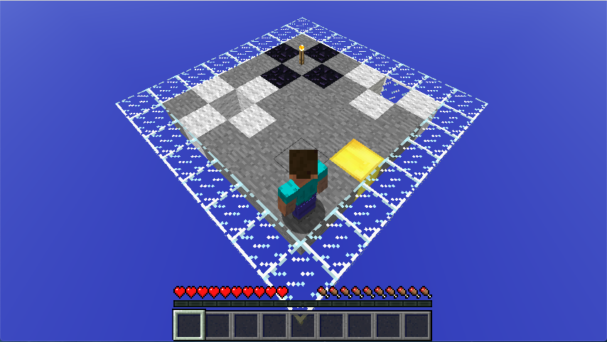
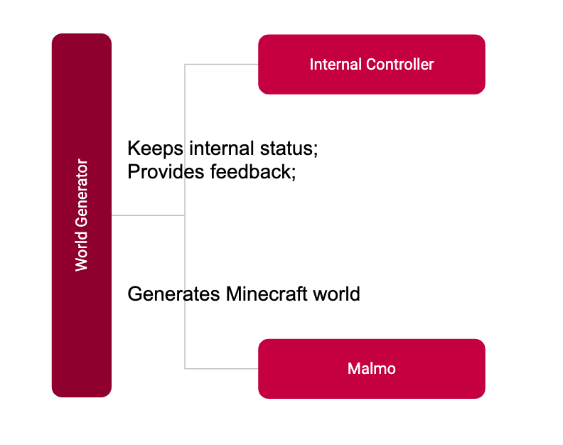
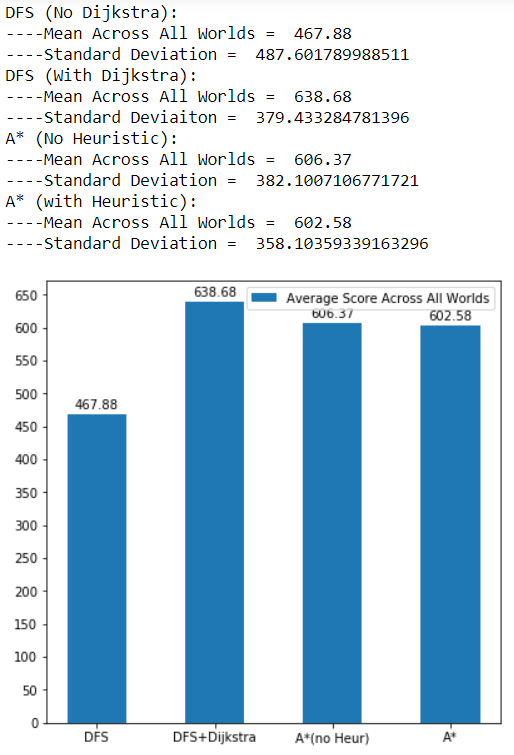
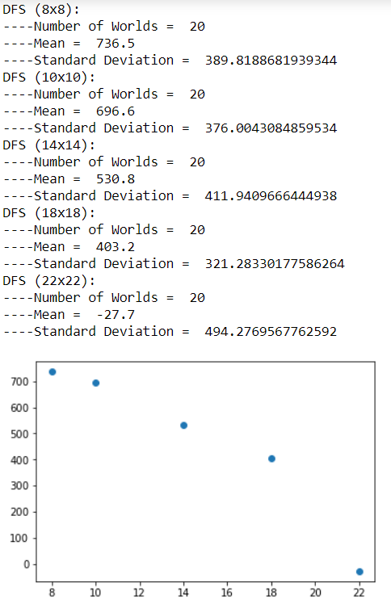
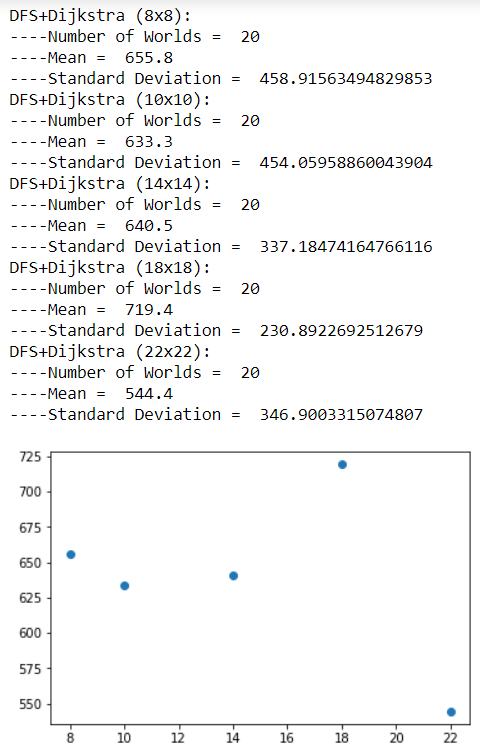
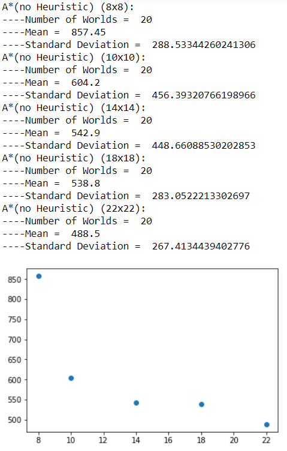
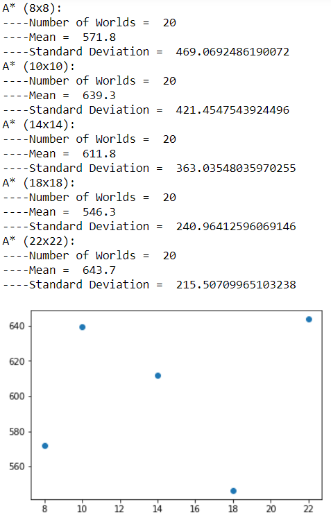

---
layout: default
title:  Final Report
---

# Final Report 

## Video

<iframe width="560" height="315" src="https://www.youtube.com/embed/mA3m5WC-KDA" frameborder="0" allow="accelerometer; autoplay; encrypted-media; gyroscope; picture-in-picture" allowfullscreen></iframe>

## Project Summary

The idea of the project is to create an AI agent that is able to solve the game of Wumpus World. For those who have not heard of Wumpus World before, the environment of this game is a world which has exactly one Wumpus with stench around its location, various number of pits with breeze around them, and exactly one gold, and the locations of these items are static and completely random. (Figure below shows an example of the world). 

An agent enters into a world described above without knowing anything except the status of the position that it’s standing on. Its goal is to try to find the gold without falling into a pit or encountering the Wumpus. Should the agent successfully narrow down the Wumpus’ location by walking adjacent to it three times, it will attack in the Wumpus’ direction and remove it as a hazard. Once the agent has found the gold, it should travel back to the starting location and leave the world. If the agent thinks the there is no way to find the gold without risking its life, it will leave without getting the gold. 

For an agent to achieve the goal, it needs to explore the world. As it encounters breezes, stenches or both at a specific position, the agent needs to decided what is the best course of action to navigate the impending hazards without dying. Because of the fact that there are multiple ways to path around the world and its hazards and that every action carries a point penalty, it is imperative to figure out the most optimal way to path around the world. To do this, we use popular AI pathfinding algorithms to see which one can yield the best results. Specifically, the algorithm we experimented with are: Depth First Search (DFS), DFS with Dijkstra’s Algorithm, A* search without heuristic, and A* search with a heuristic we came up with.




## Approaches

This project contains three main component:

- `World Generator`: generates random maps according to the input map size and number of pits.

- `Internal Controller`: contains an internal representation of the game world and provides the agent with feedback appropriate to its location.

- `AI`: contains Four algorithms that decides what action to perform.

World generator was called with input world size and number of pits. The generator returns a 2d matrix representation of a world and feeds it to Malmo, to create the world in Minecraft, and Internal Controller, to keep an internal status of the agent and provide feedback to AI. The figure below shows the relationship between World Generator, Controller and Malmo.



Four algorithms we implemented for world exploration and decision making work as follow:

### Depth First Search

Our baseline algorithm is Depth First Search because it's a relatively simple algorithm that is quick to implement. The way DFS picks the next node depends on the order on which block is added to the explorable stack. In our case, it will bias horizontal movement before vertical movement.

Keep in mind that our baseline ONLY uses DFS. Once it hits a dead end, it uses a very slow method of finding its way to the next node in the stack. It will go back through the path it has been to until it reachs a node that is adjacent to the next node popped from the stack.

```python
# psuedo-code for DFS in our implementation

# populating the explorable stack
def handleStenchBreeze(self):
	north, east, south, west = self.getAdjacents(self.current) # get coordinates for adjacent blocks

	if (not stench and not breeze): # indicates safe spots adjacent to current block
		# function that adds node to the explorable stack if it has not been visited, and updates the internal 2d matrix that keep tracks of hazards.
		self.setSafe(north) 
		self.setSafe(south)
		self.setSafe(east)
		self.setSafe(west)
		

# pops a node from explorable stack and gets a path to that node from the current spot
def getNextAction(self):
	picked = self.safeSpots.pop(0)

	coordsToMove = self.tracesteps(picked) # trace the steps from the explored list to get the coords to move
	actions = self.convertCoordToAction(coordsToMove): #converts coords to coordinal directions

	return action

```

### Depth First Search with Dijkstra's Algorithm

Our second algoirthm uses the same algorithm DFS algorith mentioned above. However, instead of tracing the steps the AI has already taken to get to another node it uses Dijkstra's Algorithm to find a path of safe spots to get to the next node. 

This is a lot faster when the AI has hit a dead end in the DFS and has to path to another node. This also improves the cost to go back to the start node once the gold has been found.

```python
# psuedo-code for DFS in our implementation

# dijkstra's for shortest path
def dijkstra(self, dest):
	start_dist = 0
	priorityQ = PQ() # class provided by Professor Eppstein of UCI
	priorityQ.setdefault(self.current, start_dist)
	trace = dict() 
	visited = set()
	trace[self.current] = [None, start_dist]
	while(True):
		current = priorityQ.smallest()
		del priorityQ[current]
		# break if destination is found
		if (current == dest):
			break;
		visited.add(current)
		n, e, s, w = self.getAdjacents(current) # get coordniates of adjacent spots

		if (n not in visited):
			priorityQ.setdefault(n, trace[current][1] + 1) # adds node we are checking to the priority queue
			trace[n] = [current, trace[current][1] + 1]    # uses a dictionary to store paths from current node to other nodes
		if (s not in visited):
			priorityQ.setdefault(s, trace[current][1] + 1)
			trace[s] = [current, trace[current][1] + 1]
		if (e not in visited):
			priorityQ.setdefault(e, trace[current][1] + 1)
			trace[e] = [current, trace[current][1] + 1]
		if (w not in visited):
			priorityQ.setdefault(w, trace[current][1] + 1)
			trace[w] = [current, trace[current][1] + 1]

def getNextAction(self):
	picked = self.safeSpots.pop(0)
	coordsToMove = self.dijkstras(picked) # trace the steps from the explored list to get the coords to move
	actions = self.convertCoordToAction(coordsToMove): #converts coords to coordinal directions

	return action()

```

### A* Search without Heuristic

Our third algorithm uses A* search to pick the next node to check. First we are trying the algorithm without a heuristic as a sort of baseline for our heuristic function later on. This is akin to an Uniform Cost Search.

This algorithm without heuristic is actually very similar to DFS in our connected map space in the sense that it will pick the node closest to itself before going to nodes further away. This algorithm is a lot slower, in terms of run time, because it has to recalculate the distance from the current node to every other node when the agent moves.

```python
#pseudo-code for A* with no heuristic

#gets next action with A* with no heuristic
def getNextAction(self):
	picked = None
	smallest = 1000

for x in list(self.safeSpots):
	current = len(self.dijkstra(self.current, x)) # uses dijkstras to determine the cost to a path
	
	if (current < smallest): # if current length is shorter than the current smallest, replace picked with current
		picked = x
		smallest = current

coordsToMove = self.dijkstra(self.current, (picked)) # gets coord path from self.current to picked
actions = self.convertCoordToAction(coordsToMove) # gets cardinal directions list to picked

return actions
```

### A* Search with Customized Heuristic

Finally, our last algorithm is an A* search with a heuristic. This algorithm uses a heuristic, as well as the cost of a path to determine which node to go to. The formula is very simply f = g - h, where f is the value we are using to determine what node to pick, g is the cost to get to that node using Dijkstra's, and h is the heuristic value of that node. The goal is to pick the node with the lowest f.

Right off the bat, finding a heuristic for our project is hard, because there's no clear end position. It's random, so coming up with a heuristic that can benefit our agent is a challenge. 

One thing we did notice while running the other algorithms is that in a DFS-similar search, the agent will follow a path before ultimately having to go back large amounts to spaces that were left unexplored, even though it might be more efficient for the AI to quickly check it before going down another path. With this in mind, our heuristic checks the spaces around a potential node to visit and will bias picking ones with more spaces already explored around it. 

Again, this is a very slow algorithm because it has to recalculate the heuristic every time the agent moves.

```python
# pseudo-code for A* with no heuristic

# code for our heuristic
def surrounding_heuristic(self, center, radius):
	# getting the boundaries depending on radius
	left = center[0] - radius
	right = center[0] + radius
	top = center[1] + radius
	bottom = center[1] - radius

	# checks how many explored nodes ar earound the center node we are checking
	surrounding_count = 0
	for x in self.explored:
		if (x[0] >= left and x[0] <= right and x[1] <= top and x[1] >= bottom):
			surrounding_count += 1

	return surrounding_count

# gets next action using A*
def getNextAction(self):
	picked = None
	smallest = 1000

for x in list(self.safeSpots):
	current = len(self.dijkstra(self.current, x)) - self.surrounding_heuristic(x, radius) # uses dijkstras to determine the cost to a path, we are subtracting nodes around because we are biasing nodes with more explored nodes around it.
	
	if (current < smallest): # if current length is shorter than the current smallest, replace picked with current
		picked = x
		smallest = current

coordsToMove = self.dijkstra(self.current, (picked)) # gets coord path from self.current to picked
actions = self.convertCoordToAction(coordsToMove) # gets cardinal directions list to picked

return actions
```

## Evaluation

### Quantitative Analysis

We evaluate our AI by giving the AI a score based on how much the AI moves across the map, if it is successful in finding the gold, and if it dies by stepping on a Wumpus or in a pit.

* Movement: -2 for each block the agent moves across
* Gold: +1000 for finding the gold and leaving
* Agent Dies: -10,000 for either stepping on a Wumpus or into a pit (in theory, this should never happen for our AI)

Our agent will receive a penalty the longer it takes to complete a world and how many times the AI backtracks across blocks it already knows about. It will also ensure our agent does not waste time exploring if it already has the gold and will try to take the shortest path it can find back to the start. It will also be heavily penalized for walking into pits and the Wumpus because it should never take an action that would lead to one. With this scoring criteria, it will also now be obvious how an agent does in each world when the score is printed and recorded. 

* Negative numbers suggest that the agent was not able to find the gold, whether that be because it was impossible to find without putting the agent in danger or because the AI algorithm was not working properly. 

* Very large negative numbers suggest the AI is making choices that lead to the agent dieing which should not happen since the agent should prioritize safety. 

* Positive numbers suggest that the AI has found the gold and was able to leave the cave safely. 

* A score of 0 is a special case where the start of the world warned the agent of danger so the agent should not take the risk and leave before it makes a wrong choice and dies.

For each algorithm we recorded the scores and calculated the average score across all worlds. These worlds had varying sizes from 8x8, 10x10, 14x14, 18x18, and 22x22 with 20 different worlds for each world size totalling at 100 different worlds for each algorithm.

The averages for each algorithm are as follows:



We also divided the data down to show the average performance for each world size for each algorithm:

#### DFS


DFS performed decently although the 22x22 worlds seemed to not find the gold too much or was backtracking a lot which makes sense since the larger size makes the world more complex leading to longer backtracking for dead ends.

#### DFS + Dijkstra


DFS with Dijkstra performed signifcantly better than standard DFS not only overall, but also for each world size. It seems that using Dijkstra to bypass long backtracks helped improve the overall scores for the agent, even across larger worlds.

#### A* Without a Heuristic


A* without a heuristic seems to perform similarly to DFS+Dijkstra overall. However, A* seems to have a more defined curve for decreasing in score.

#### A* With Radius Heuristic


While not being strictly better than the others, A* using the radius heuristic seems have gotten averages closer together even across different sized worlds. The range for the average scores across the different sizes is signifcantly smaller than the ranges for some of the other algorithms.


Some of the sporadic nature of the graphs can also be attributed to the randomness of the worlds being generated. The gold is randomly placed throughout the world which means some worlds might have gold be closer to the start than others. It is also more likely to happen on smaller sized worlds.

### Qualitative Analysis

A qualitative analysis is not obvious at first glance given how the agent moves 1 block at a time. However, certain scenarios show the improvements some algorithms have over others. For example, when the agent explores the map in a spiral-like path, it will eventually run out of unexplored blocks within the sprial. However, there may be blocks outside of the recently explored area that should be searched next. The way the agent backtracks to and picks an unexplored area helps show the benefits of different algorithms.

The simplest algorithm we used was DFS which basically goes in one direction until it gets stopped. However, when DFS runs itself into a dead end, it will reverse every step it has taken until it can find an unexplored region. The backtracking from DFS can make the agent's score for the world go down very quickly. Unecessary backtrack may result in extra steps that might not need to be taken.

One of the solutions we came up with is to add a Dijkstra's protocol to when DFS wants to find an unexplored area. Instead of backtracking through every action it has taken, Dijkstra's will instead find the shortest path along the explored blocks to get to the inexplored region. Now, Dijkstra's will minimize the number of steps when trying to find an unexplored region compared to standard DFS.

For A* search without using heuristics, it should perform similarly in that the next unexplored area will be chosen based on the distance away from the block the agent is currently standing on.

For A* search with the radius heuristic, the agent tries to minimize backtracking by checking one off blocks that might be missed. For example, if the agent ran through a 3x3 square of blocks but did not touch the center block and continued searching other parts of the world, it might then take a long time backtracking just to explore that single block that was missed because it explored all of the other blocks surrounding it. With the radius heuristic, if a block is surrounded by multiple explored blocks, the agent will quickly check it when it is still relatively nearby so as not to incur a long backtrack from ignoring it.


## References
* Priority Queue Class (written by David Eppstein)

#### Images
* Block Images used in the Video: [Gamepedia Minecraft Wiki](https://minecraft.gamepedia.com/Minecraft_Wiki)