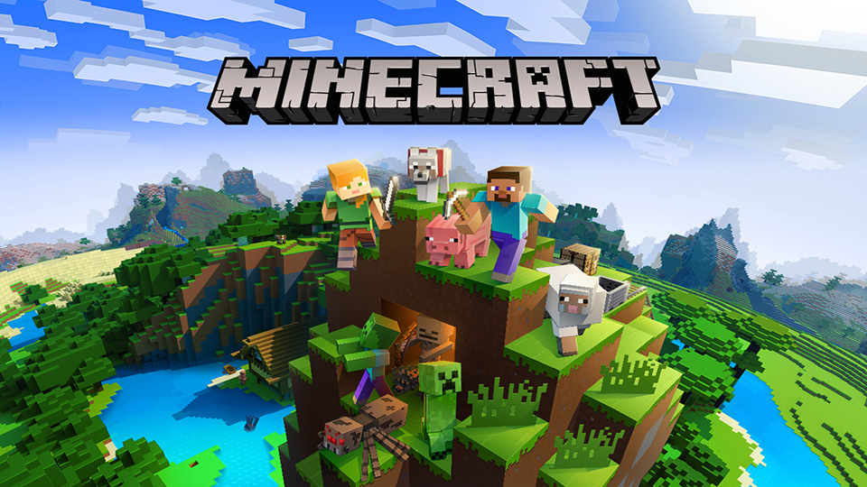

## Welcome To Project Wumpus AI

To view the source code, click [here](https://github.com/hd-tran/WumpusAI).

Hello, and welcome to Team WumpusAI project page! Here you will find the proposal as well as the detailed report about our project.

### System Overview

The AI agent of our project can intelligently navigate through a Wumpus World map which contains several types of hazard that can kill the agent. Figure belows show Minecraft representation of the environment in Wumpus World. For more information about our project, click [here](https://0o0liver.github.io/XDLMAO/final.html).

### Hope you enjoy our website!
